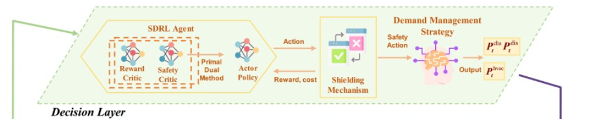
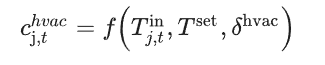

# 论文1
本文提出了一种基于强化学习（RL）的分布式前导巡航控制（LCC）策略，用于混合车辆排，以确保距离安全。首先，提出了一个由互联自动驾驶车辆（CAV）和人驾驶车辆（HDV）组成的混合车辆排的分布式建模框架。然后，基于参数共享近端策略优化（PS-PPO）算法，设计了强化学习控制器以实现混合车辆排的分布式 LCC。此外，采用了由鲁棒控制障碍函数（RCBF）和二次规划（QP）组成的安全关键控制层，以提供距离安全保障。为了将框架扩展到多车道场景，引入了一个基于有限状态机（FSM）的决策模块，用于管理每个 CAV 的车道变换行为。最后，分布式安全 LCC 策略在城市出行（SUMO）平台模拟中，无论是单车道还是多车道场景中都得到了验证。

# 安全强化学习
Physics-augmented safe reinforcement learning for overload mitigation in distribution networks under weather-sensitive thermal constraints

安全强化学习（SRL）作为一种有前景的解决方案出现，旨在最大化预期奖励，同时遵守部署期间的安全约束。
这些安全强化学习方法大致可分为两种方法：一种将安全违规的惩罚因素纳入价值函数，另一种则将安全政策生成机制整合进训练过程，以增强探索阶段。

带有安全约束的 MARL 问题通常定义为 C-MDP

决策层利用 SRL 代理优化暖通空调电力调度

暖通空调舒适约束

1）Shield：处理设备级硬约束

HVAC 的舒适温度约束

2）Safety Critic：处理网络级安全约束  （cost critic）
为保证室内热舒适约束在强化学习控制过程中得到满足，本文构建安全评论家网络（safety critic），用于评估状态—动作对在未来时域内引发舒适违规的累计风险。考虑到本文以温度设定点作为控制动作，设定点对室温的影响具有显著热惯性和时滞特性，因此仅依赖瞬时奖励难以有效约束未来舒适违规。为此，定义舒适安全代价函数为各控制区域室温超出舒适边界的加权惩罚，并由 safety critic 近似对应的约束价值函数。策略更新时，在最小化能耗目标的同时，结合 safety critic 输出抑制可能导致未来舒适越界的设定点调整，从而实现能耗优化与热舒适安全的协调控制。

学习：在当前状态下，给出这个设定点后，未来会不会导致舒适违规、设备越界或系统运行风险上升。

方案一：只对舒适越界计成本

方案二：把“接近边界”也视为风险

如果你不想等真正越界才惩罚，可以设置一个预警带。比如舒适区是 24–26°C，你可以把 24.5–25.5 之外就开始给小 cost，真正越界给大 cost。

方案三：舒适违规 + 动作剧烈波动
因为你控制的是设定点，用户体验往往不只取决于室温，还取决于设定点是否来回跳。抑制策略频繁大幅修改设定点。

3）Reward critic
它要学会评价“当前这个温度设定点动作，从长期看到底值不值”。
对你这个问题来说，因为动作是温度设定点，而目标通常是降低能耗，同时尽量维持室温控制效果，所以 reward critic 最合适的定义就是一个经济性能导向的状态—动作价值函数。

本文将即时奖励设计为能耗项与室温偏差项的加权负值，以鼓励策略在降低系统能耗的同时维持较好的室温控制品质；而对于超过舒适边界的温度越界行为，则单独构造安全代价函数，并由 safety critic 进行评估，从而实现性能优化与安全约束的分层处理。

Energy management based on safe multi-agent reinforcement learning for smart buildings in distribution networks

该算法中，引入了危害值以增强非安全多智能体强化学习算法并满足安全约束。

安全 MARL 的最新进展主要集中在政策网络中集成“安全层”以应对电压违规，该层采用数据驱动的线性近似安全集，以强制最小的动作调整以满足安全约束

District cooling system control for providing regulation services based on safe reinforcement learning with barrier functions

采用高斯过程学习未知系统模型以构建安全集，提出了控制障碍函数以保证约束安全。

在将传统 DRL 应用于 DCS 控制问题时存在一个关键限制，即 DRL 代理早期训练过程中随机探索带来的安全风险。 在模型无限制的 DRL 代理达到良好训练之前，它需要通过大量的“试错”学习知识，这可能违反关键的安全约束，导致灾难性的控制结果。

为克服传统DRL的安全问题，我们提出将控制障碍功能（CBF）控制器与传统强化学习结合，形成一种新型安全RL控制器，确保每一步都实现约束安全。

**安全动作是通过RL和CBF构造的一个二次规划问题输出，安全约束（舒适违规）也得放进RL控制器的reward函数里**

如果 Actor 给出的动作会导致下一步室温越界（超出舒适范围），那么 shield 不允许它直接执行，而是把动作投影到最近的可行边界。真正送入环境执行的是 shield 后的动作，不是 actor 原始动作

# 把“平铺动作”改成“结构化动作生成”
同样输出每个区的连续设定点，但内部不是一次性直接回归 112 维，而是做 全局决策 + 分区修正，或者 共享 zone policy + 每区参数共享 head。
这类创新点很好写，因为你没改 action，只是改了 policy parameterization，核心故事是“提升高维连续控制的可扩展性和 credit assignment”

# 做“安全层 / 投影层”，不是改目标
PPO 先输出候选设定点，再经过一个可微或规则投影层，保证动作满足物理/工程约束，比如：
heating <= cooling - delta
|a_t - a_{t-1}| <= r
占用时段更严格，非占用时段更宽松
动作和 reward 都不变，但方法从“普通 PPO”升级成“safe HVAC RL”。这比加一个动作平滑 penalty 更像方法论文

# 做“泛化”，不是只做单建筑单天气
同样还是输出温度设定点、优化能耗和温度，但让 policy 对天气、月份、建筑类型、占用模式做 condition，验证 unseen weather / unseen building。这样论文主线就从“我把 PPO 跑起来了”变成“我提出了可迁移的 HVAC 控制器”。

# 奖励函数
不是把舒适度和能耗继续加权，显式约束做 CMDP / shield / barrier / action projection

# 创新点
热区拓扑建模：
不是把 56 个热区当成无结构向量，而是从 1.epJSON 自动提取 inter-zone adjacency，构建热区邻接图，用建筑几何拓扑显式表示多区热耦合关系。

结构化动作生成：
在 PPO+LSTM 框架下，不再直接平铺回归 112 维设定点，而是设计 neighbor-aware structured action generator：LSTM 负责时序记忆，邻接图负责局部热耦合建模，共享 zone decoder 为每个热区生成“邻域基准动作 + 区域残差动作”。

约束型安全控制：
把舒适度从 reward 加权项改成显式约束，并加入工程上必要的动作可行性约束，例如 heating < cooling、**动作变化率限制**、邻域动作一致性约束；训练或执行时通过 projection/shielding 保证动作可部署。

# 已经实现的功能
奖励函数：
不是把舒适度和能耗继续加权，显式约束做 CMDP / shield / barrier / action projection

结构化动作生成：
PPO+LSTM的平铺动作输出被改造成拓扑约束的结构化动作生成。

安全层：
加入二次规划安全层（动作输出）

# 启发式算法

超参数调整

Table 3. Hyperparameter search space for population-based training.

| Parameter | Search Range |
| :--- | :--- |
| Learning Rate | $[1 \times 10^{-5}, 1 \times 10^{-2}]$ |
| Entropy Coefficient | [0.01, 0.5] |
| Clip Range | [0.1, 0.3] |
| Discount Factor ($\gamma$) | [0.95, 0.99] |
| GAE Lambda | [0.9, 1.0] |
| Batch Size | [64, 512] |